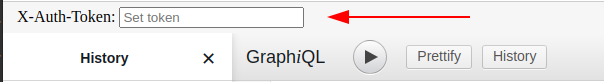

Custom rendering
===============

It may be useful to change template to provide additional fields for more comfortable providing of [custom headers](custom-http-headers.md).

It can be done the following way:

1. Override the default GraphiQL template:

```yaml
# config/packages/graphiql.yaml or app/config/config.yml for Symfony without Flex
overblog_graphiql:
    template: "GraphiQL/index.html.twig"
```
2. Create a new template:

You have to override block `graphiql_render` and soon of all you have to override block `graphql_fetcher_headers`.

```twig
{# templates/GraphiQL/index.html.twig #}



    ReactDOM.render(
        {# add your custom implementation here #}
        ,
        document.body
    )

```

### Example: add "X-Auth-Token" field and header

```twig
{# templates/GraphiQL/index.html.twig #}



    {{ parent() }}

    let token = document.getElementById('x_header_value').value;
    if (token) {
        headers['X-Auth-Token'] = token;
    }



    ReactDOM.render(
        React.createElement('div', { style: { height: '100%' } },
            React.createElement('div', { style: { background: '#f6f6f6', padding: '5px 15px' }, },
                React.createElement('label', { htmlFor: 'x_header_value' }, 'X-Auth-Token: '),
                React.createElement('input', {
                    id: 'x_header_value',
                    type: 'text',
                    placeholder: 'Set token',
                }),
            ),
            React.createElement(GraphiQL, {
                fetcher: graphQLFetcher
            }),
        ),
        document.body,
    );

```
How this looks like:


