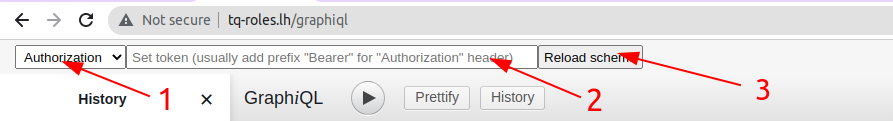

Custom rendering
===============

It may be useful to change template to provide additional fields for more comfortable providing of [custom headers](custom-http-headers.md).

It can be done the following way:

1. Override the default GraphiQL template:

```yaml
# config/packages/graphiql.yaml or app/config/config.yml for Symfony without Flex
overblog_graphiql:
    template: "GraphiQL/index.html.twig"
```
2. Create a new template:

You have to override block `graphiql_render` and soon of all you have to override block `graphql_fetcher_headers`.

```twig
{# templates/GraphiQL/index.html.twig #}



    ReactDOM.render(
        {# add your custom implementation here #}
        ,
        document.body
    )

```

### Example

See template [@OverblogGraphiQL/GraphiQL/auth.html.twig](../src/Resources/views/GraphiQL/auth.html.twig). How it looks like:



There is:

1. Header used for the authorization.
2. Header value (token) for the authorization.
3. Button to load schema when the header value (token) typed.

So, you can extend base template [@OverblogGraphiQL/GraphiQL/index.html.twig](../src/Resources/views/GraphiQL/index.html.twig) or use that.